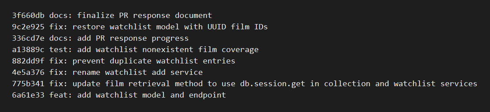

# PR Response Doc - CineLog Watchlist Feature

## AI Usage
I used Codex as a second set of eyes while working through the review. I had it help me compare the watchlist code against the existing collection patterns, then I checked the actual files myself before making changes. For Comments 4 and 5, I asked it to point out tradeoffs for public-by-default watchlists and alphabetical sorting; I kept my final answer shorter and focused it on CineLog's community use case and the current lack of search/sort controls. I also used it to sanity-check the final test run and commit history.

## Comment 1 - Rename
**What I did:** Renamed `save_to_watchlist()` to `add_to_watchlist()` in `services/watchlist_service.py`. That matches the existing service naming style, like `add_to_collection()`.

**How I verified:** I searched for `save_to_watchlist` to make sure the old name was gone, then ran the test suite.

## Comment 2 - Deduplication
**What I did:** Added `AlreadyInWatchlistError` and checked for an existing `WatchlistEntry` before creating a new one. The route returns a `409` if the user tries to add the same film twice.

**How I verified:** I added `test_add_to_watchlist_duplicate_raises`, which confirms the error is raised and only one row exists.

## Comment 3 - Missing test
**What I did:** Expanded `tests/test_watchlist.py` so the watchlist service has the same basic coverage as the collection service:

- `test_add_to_watchlist_creates_entry`
- `test_add_to_watchlist_duplicate_raises`
- `test_add_to_watchlist_nonexistent_film_raises`

**How I verified:** Ran `python -m pytest tests/ -v`; all tests passed.

## Comment 4 - Default visibility
**My position:** I kept `public=True` as the default.

**Reasoning:** CineLog is a community film app, so public watchlists fit the product better for this first version. It makes it easy for people to share what they want to watch next.

**Tradeoff:** Privacy is the main downside. Some users may expect a watchlist to be private, so the UI should make this default clear. If privacy settings become more important later, I would revisit the default.

## Comment 5 - Sort order
**My position:** I kept watchlists sorted alphabetically.

**Reasoning:** A watchlist feels more like a saved reference list than a history feed. Alphabetical order makes it easier to scan for a title, especially since there is no search or sort option yet.

**Tradeoff:** Sorting by newest first would also make sense if users treat the watchlist like a queue. If that becomes the expected behavior, I would either switch to `date_added.desc()` or add a `sort=` query parameter.

## Comment 6 - Rebase
**What conflicted:** Rebasing onto `origin/main` hit an `.gitignore` conflict, and the larger code issue was that `main` had changed film IDs from integers to UUID strings.

**How I resolved it:** I kept the combined ignore rules and updated the watchlist model/service/route docs to use UUID film IDs. I also kept the watchlist relationships on `User` and `Film`, plus the unique constraint on `(user_id, film_id)`.

**How I verified:** I ran the full test suite and checked that there were no merge commits with `git log --merges --oneline origin/main..HEAD`.

## Bonus - remove_from_watchlist()
**What I added:** Added `remove_from_watchlist(user_id, film_id)` in `services/watchlist_service.py` and exposed it through `DELETE /watchlist/<user_id>/remove`.

**Missing film behavior:** If the film is not currently on the user's watchlist, the service raises `NotInWatchlistError`. The route catches that and returns a `404`, which matches the way `remove_from_collection()` handles `NotInCollectionError`.

**Pattern followed:** The function follows the same lookup/delete/commit pattern as `remove_from_collection()`, and the endpoint uses the same request body shape: `{ "film_id": "<uuid>" }`.

**Test written:** I added tests for successful removal and for trying to remove a film that is not on the watchlist.

## Bonus - Second Test
**Extra edge case:** I chose `test_remove_from_watchlist_missing_entry_raises`.

**Why I chose it:** This is the case most likely to cause confusing behavior if it is missed. Without a clear error, a failed delete could look like it worked even though the film was never saved. The test makes sure the service raises `NotInWatchlistError` instead.

## Bonus - Visibility Toggle Endpoint
**What I added:** Added `PATCH /watchlist/<user_id>/visibility`.

**How `public` works:** New watchlist entries still default to `public=True`. A caller can update that value by sending:

```json
{
  "film_id": "<film_uuid>",
  "public": false
}
```

The endpoint returns the updated `WatchlistEntry`. If `public` is missing or is not a boolean, the route returns `400`. If the film is not on the user's watchlist, it returns `404`.

**Test written:** I added tests for updating an entry to private, for the endpoint returning the updated value, and for rejecting a non-boolean `public` value.

## PR Description
This PR adds a watchlist feature so users can save films they want to watch later. It supports adding, viewing, removing, and changing the public/private visibility of saved films. Duplicate adds and missing films return clear errors instead of falling through to database errors.

Design decisions:

- Watchlist entries default to `public=True` because CineLog is community-focused.
- Watchlists are sorted alphabetically for now because that makes the saved list easier to scan.
- Visibility changes require an explicit boolean `public` value so callers do not accidentally make an entry public or private.

Manual testing steps:

1. Run `python app.py`.
2. Create or find a user ID and film UUID in the local database.
3. Send `POST /watchlist/<user_id>/add` with `{ "film_id": "<film_uuid>" }` and confirm a `201`.
4. Send the same POST again and confirm a `409`.
5. Send `GET /watchlist/<user_id>` and confirm the film appears.
6. Send `PATCH /watchlist/<user_id>/visibility` with `{ "film_id": "<film_uuid>", "public": false }` and confirm the response has `"public": false`.
7. Send `DELETE /watchlist/<user_id>/remove` with `{ "film_id": "<film_uuid>" }` and confirm a `200`.
8. Send the same DELETE again and confirm a `404`.

## Git Log Screenshot


